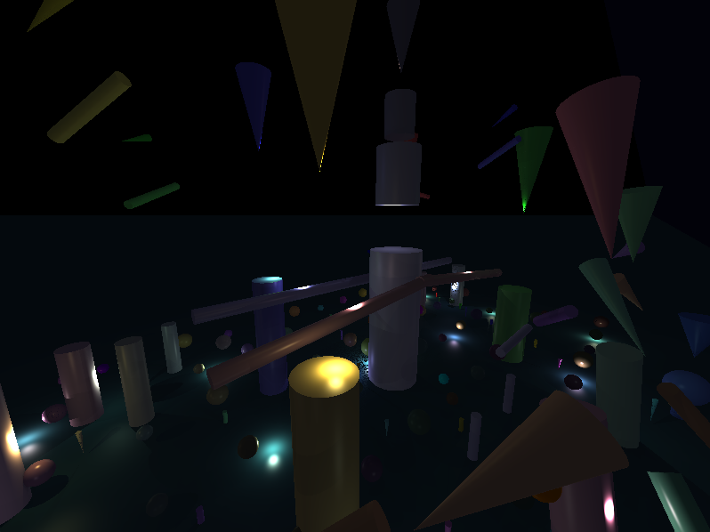
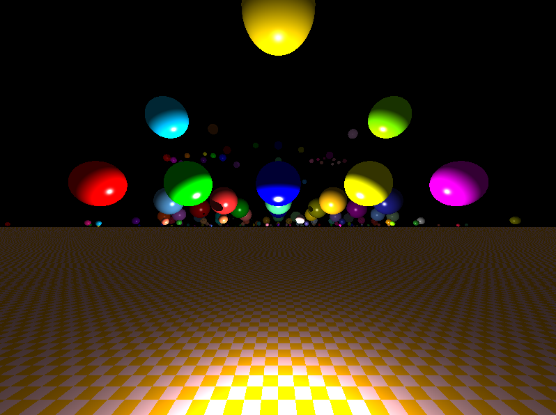
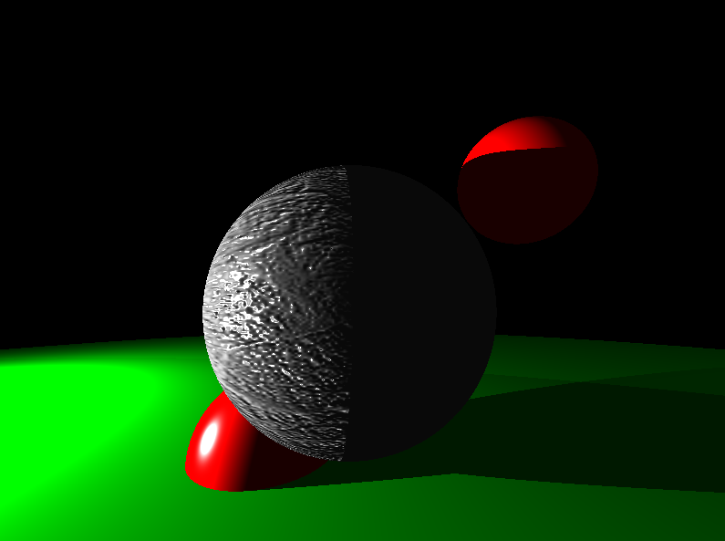

# MiniRT
### a Basic Ray Tracing Project in C





## 🎯 Overview

miniRT is an educational ray tracing project developed as part of the 42 curriculum. This implementation features a full set of basic ray tracing capabilities with additional bonus features, providing a robust foundation for rendering 3D scenes.

## ✨ Features

- **Primitive Objects:**
  - Spheres
  - Planes
  - Cylinders
  - Cones

all primitive objects are calculated with their respective geometric formulas and not made up of triangles.

- **Advanced Rendering:**
  - Blinn-Phong reflection model
  - Multiple light source support
  - Texture mapping
  - Bump mapping for enhanced surface detail
  - Multi-threaded rendering for improved performance

- **Interactive Controls:**
  - Camera movement using WASD + QE keys
  - Arrow key navigation
  - Mouse-controlled camera rotation (hold right button)
  - Speed modifier (hold Shift)

## 🚀 Getting Started

### Prerequisites

- GCC compiler
- Make

### Installation

1. Clone the repository:
```bash
git clone https://github.com/Moat423/42miniRT.git
cd 42miniRT
```

2. Compile the project:
```bash
make
```

### Usage

Run the program with a scene file:
```bash
./miniRT <scene_file.rt>
```

Example:
```bash
./miniRT scenes/RiW2.rt
```

## 🎮 Controls

| Action | Control |
|--------|---------|
| Move Forward | W |
| Move Backward | S |
| Strafe Left | A |
| Strafe Right | D |
| Move Up | E |
| Move Down | Q |
| Rotate Camera | Hold Right Mouse Button + Move |
| Fast Movement | Hold Shift + Movement Keys |

## 🔧 Technical Details

### Ray Tracing Implementation
- Multi-threaded rendering engine for optimal performance
- Optimized intersection calculations
- Advanced light calculation system supporting multiple light sources

### Supported Scene Elements
- Multiple geometric primitives
- Texture mapping with support for various patterns
- Bump mapping for surface detail enhancement
- Configurable camera positions and properties
- Multiple light sources with adjustable intensity

### Scene File Format
Scene files use the `.rt` extension and follow a specific format to define:
- Camera properties
- Light sources
- Object properties and positions
- Texture and material definitions

## 🖥️ Platform Support

- Primary support for Linux systems
- Compatible with MacOS (requires specific Makefile configuration)

## 📝 License

This project is released under the MIT License - making it freely available for educational purposes.

## 🙏 Acknowledgments

- MinilibX library by Codam
- 42 School for the project subject
